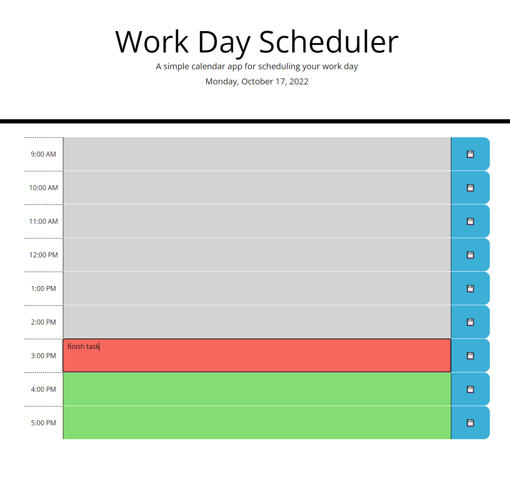

# Event Scheduler

## Description

This project was to practice and hone my skills using third-party APIs. I mostly used Bootstrap to construct the website through HTML classes along with an API called luxon which handles dates and times used in the project. This project will also be useful to plan out your tasks throughout the hours of work to better pace yourself. 

## Installation

N/A

## Usage

Visit the website https://nicolasflamel.github.io/event-scheduler/ to see the working project. At the top under the title it will display today's date which will change dyanically. Under the header there's a table with standard business hours with textboxes next to them where you can type in tasks for that hour. Each hour is color coded to respresent whether it is in the past, present, or the future to better see what tasks should have been completed, should be worked on and are coming up. After writing in a task or erasing one you must click on the save icon to the right of that text field to save it and it will presist even if you refresh or close the page. 

## Credits

N/A

## License

N/A